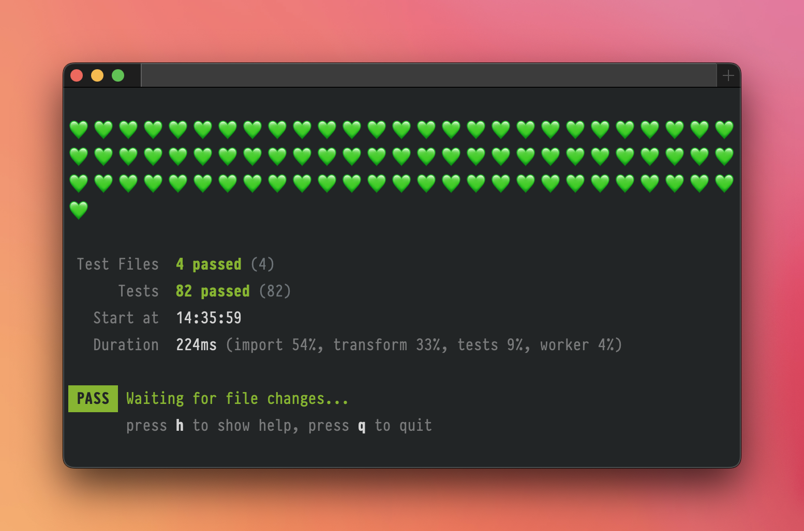

# Power Mode Reporter (Vitest)

Awesomely engaging Power Mode reporter for Vitest



Currently, you can customize:

- Individual test result symbols
- Test run result sounds (macOS)

The rest inherits Vitest's summaries, failure diagnostics, console handling, and
watch controls.

## Install

```sh
pnpm add -D power-mode-reporter.vitest
```

## Configure

```ts
import { defineConfig } from 'vitest/config'
import { PowerModeReporter } from 'power-mode-reporter.vitest'

export default defineConfig({
  clearScreen: false,
  test: {
    reporters: [new PowerModeReporter({ sound: true })],
  },
})
```

`clearScreen: false` preserves watch history. Select this as your terminal reporter
to get one set of symbols and one summary. Other output formats, such as JUnit, can
be added separately.

Package-name configuration also works:

```ts
reporters: [['power-mode-reporter.vitest', { sound: true }]]
```

`PowerModeReporter` is both a named and default export. `PowerModeReporterOptions` is exported
for typed configuration and includes the native `DotReporter` constructor options.

### Try this checkout

```sh
pnpm install --frozen-lockfile
pnpm run build
pnpm run test:watch --reporter=./dist/index.js --clearScreen=false
```

Restart the watch process after rebuilding the reporter.

## Options and defaults

| Option | Default | Meaning |
| --- | --- | --- |
| `isTTY` | Automatic | Native terminal mode, subject to terminal/CI restrictions |
| `silent` | Vitest configuration | Native console handling: `true`, `false`, or `'passed-only'` |
| `dot` | `💚` | Passing test symbol |
| `failDot` | `💔` | Failing test symbol |
| `skipDot` | `💛` | Skipped/todo test symbol |
| `sound` | `true` | Master switch for all run sounds |
| `soundFile` | `/System/Library/Sounds/Glass.aiff` | Successful run with passing tests |
| `failSoundFile` | `/System/Library/Sounds/Basso.aiff` | Failed run |
| `interruptedSoundFile` | `false` | Cancelled/interrupted run |
| `skippedSoundFile` | `false` | Every test skipped/todo |
| `emptySoundFile` | `false` | Successful run containing no tests |

Every sound-file option accepts a path or `false` to mute that outcome. `sound: false`
mutes all outcomes. `silent` controls test console output, so use `sound` to mute audio.

Package-wide defaults are in the constructor in `src/reporter.ts`. Edit the values
before `...options`, run `pnpm run build`, and restart Vitest. Consumer options override
those defaults; environment overrides take precedence over consumer options.

## Custom symbols

```ts
new PowerModeReporter({
  dot: '💚',
  failDot: '💔',
  skipDot: '⏭️',
})
```

Symbols accept printable text, including emoji. Empty strings and terminal control
characters are rejected. Use `dot: '·'` for Vitest's original passing symbol.

Completed tests print their symbols with a space between each as results arrive,
wrapping at terminal width without truncation. Emoji and combining characters are
measured as displayed glyphs. Output appends to the terminal; console logs begin on
a fresh line. Vitest prints test counts, timing, snapshots, error diagnostics, and
the watch prompt.

## Sounds and run outcomes

```ts
new PowerModeReporter({
  sound: true,
  soundFile: '/System/Library/Sounds/Glass.aiff',
  failSoundFile: '/System/Library/Sounds/Basso.aiff',
  interruptedSoundFile: '/System/Library/Sounds/Pop.aiff',
  skippedSoundFile: '/System/Library/Sounds/Tink.aiff',
  emptySoundFile: false,
})
```

At most one sound is selected at the end of each run, including watch reruns:

1. An interrupted run uses `interruptedSoundFile`, even if some tests failed before cancellation
2. A failed run, assertion, collection error, hook error, or reported unhandled error uses `failSoundFile`
3. A successful run with passing tests uses `soundFile`, including mixed passing and skipped tests
4. An entirely skipped/todo run uses `skippedSoundFile`
5. An allowed empty run uses `emptySoundFile`; an empty run rejected by Vitest uses `failSoundFile`

Sounds describe the current run, including partial watch reruns. Earlier results do
not change the current run's sound. Vitest owns all watch input and cancellation.
Sound selection uses Vitest's run-end callback; configuration errors that prevent
reporter initialization produce no sound.

Audio plays only on interactive macOS terminals. Relative paths resolve from the
Vitest process directory. Playback uses `/usr/bin/afplay` asynchronously with an
argument array and no shell. Missing files and playback errors are silent.
If a sound is still playing, the next sound is skipped to avoid overlap. Playback
never delays a rerun or keeps Node alive; a sound already playing may finish after
Vitest exits.

## Environment and terminal support

| Variable | Overrides |
| --- | --- |
| `VITEST_HYPE_SOUND` | `sound` |
| `VITEST_HYPE_SOUND_FILE` | `soundFile` |
| `VITEST_HYPE_FAIL_SOUND_FILE` | `failSoundFile` |
| `VITEST_HYPE_INTERRUPTED_SOUND_FILE` | `interruptedSoundFile` |
| `VITEST_HYPE_SKIPPED_SOUND_FILE` | `skippedSoundFile` |
| `VITEST_HYPE_EMPTY_SOUND_FILE` | `emptySoundFile` |

`VITEST_HYPE_SOUND` accepts `1`/`0`, `true`/`false`, and `on`/`off`, ignoring case
and surrounding whitespace. Invalid values are ignored. Sound-file variables accept
a path or `0`, `false`, or `off` to mute that outcome; blank values are ignored.
Environment values take precedence over options, followed by defaults.

CI, redirected output, `TERM=dumb`, and `isTTY: false` disable sound and colour.
`isTTY: true` cannot override CI or non-TTY restrictions. Configured Unicode symbols
still appear beside Vitest's totals and diagnostics. `NO_COLOR` (nonempty) and
`FORCE_COLOR=0` disable symbol colours without muting sound.

CI detection recognises `CI`, GitHub Actions, GitLab, Buildkite, CircleCI, Jenkins,
TeamCity, Azure Pipelines, Travis, AppVeyor, and Bitbucket. An explicitly false `CI`
value does not override an active provider variable.

## Implementation and compatibility

`PowerModeReporter extends DotReporter`, imported from `vitest/node`, following
[Vitest's reporter extension API](https://vitest.dev/api/advanced/reporters.html).
We customize completed-test symbols and select a sound at run end. The built-in dot
window is disabled to prevent duplicate symbols. Native summaries, diagnostics,
watch shortcuts, and deferred console output for `silent: 'passed-only'` are inherited.

Vitest documents its reporter classes as an advanced API that can change in minor
releases. Integration and package-consumer checks exercise both 4.1.11 and 5.0.2.
CI covers Node 22/24 on Linux, with macOS/Windows smoke tests.

## Development and publishing

Use pnpm 10.33.2, pinned in `package.json` via `packageManager`.

```sh
pnpm install --frozen-lockfile
pnpm run check
```

`check` runs types, unit tests, real Vitest fixtures and watch reruns, and tarball
verification. Audio tests use mocked processes. On macOS/Linux, also run
`python3 scripts/verify-tty.py` after building to exercise a real terminal, native
watch shortcuts, changing outcomes, narrow output, and Ctrl+C without playing sound.

`pnpm run verify:package` builds `artifacts/power-mode-reporter.vitest-0.1.0.tgz`,
installs it into a temporary consumer using pnpm's store and the locked test
dependencies, and checks ESM imports, declarations, peer resolution, and package-name
reporter configuration. Run `pnpm install --frozen-lockfile` first to populate the
store. Set `VITEST_VERIFY_VERSION=4.1.11` to check that release after caching its
dependencies.

For the initial development release, keep the version at `0.1.0`, run the checks,
inspect `pnpm pack --dry-run`, then publish the verified tarball:

```sh
pnpm publish ./artifacts/power-mode-reporter.vitest-0.1.0.tgz --publish-branch trunk
```

Publication is a separate, manual release action. For subsequent releases, update
the version and lockfile before running the checks, and publish the matching tarball.

## License

MIT © Richard Jones
